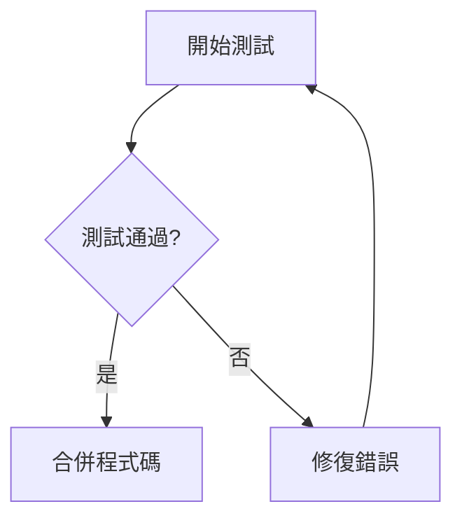

# Third-Party Tools

## 核心測試工具

### Pytest (v7.4+)

**用途**: Python 測試框架核心

**功能**:
- 測試收集與執行
- Fixtures 依賴注入
- 參數化測試
- 斷言重寫

**官方文件**: https://docs.pytest.org/

**安裝**:
```bash
pip install pytest>=7.4.0
```

**關鍵插件**:
- `pytest-xdist`: 並行執行
- `pytest-timeout`: 超時控制
- `pytest-cov`: 覆蓋率報告
- `pytest-html`: HTML 報告

---

### pytest-xdist (v3.3+)

**用途**: 並行測試執行

**功能**:
- 多核心並行執行
- 分散式測試
- 負載平衡

**文件**: https://pytest-xdist.readthedocs.io/

**使用方式**:
```bash
# 自動偵測 CPU 核心數
pytest -n auto

# 指定並行數量
pytest -n 4

# 按檔案分組
pytest -n auto --dist loadfile
```

**效能提升**: 通常可提升 2-4 倍執行速度

---

### Allure (v2.13+)

**用途**: 測試報告視覺化

**功能**:
- 美觀的測試報告
- 測試歷史趨勢
- 失敗截圖附件
- 分類統計

**文件**: https://docs.qameta.io/allure/

**安裝**:
```bash
# Python 套件
pip install allure-pytest

# Allure CLI
# Windows: 下載並解壓到 PATH
# Mac: brew install allure
# Linux: apt-get install allure
```

**使用方式**:
```bash
# 執行測試並生成資料
pytest --alluredir=allure-results

# 開啟報告
allure serve allure-results

# 生成靜態報告
allure generate allure-results -o allure-report --clean
```

**CI/CD 整合**:
- GitHub Actions: `simple-elf/allure-report-action`
- Jenkins: Allure Plugin
- GitLab: Allure Docker

---

### JMeter (v5.x)

**用途**: 效能與負載測試

**功能**:
- HTTP/HTTPS 負載測試
- 併發用戶模擬
- 回應時間分析
- Dashboard 報告

**文件**: https://jmeter.apache.org/

**安裝**:
```bash
# Windows: 下載並解壓
# https://jmeter.apache.org/download_jmeter.cgi

# Mac
brew install jmeter

# Linux
apt-get install jmeter
```

**測試計畫**:
- `ollama_llama3_single_request.jmx`: 基線測試
- `ollama_llama3_concurrent_requests.jmx`: 併發測試
- `ollama_llama3_stress_test.jmx`: 壓力測試
- `ollama_llama3_long_duration_stress.jmx`: 穩定性測試

**執行方式**:
```bash
# GUI 模式（調試）
jmeter -t tests/performance/ollama_llama3_single_request.jmx

# CLI 模式（正式）
jmeter -n -t tests/performance/ollama_llama3_concurrent_requests.jmx \
       -l results.jtl \
       -e -o jmeter-report
```

---

## CI/CD 工具

### GitHub Actions

**用途**: 自動化測試與部署

**功能**:
- PR 自動測試
- 定時執行 (Cron)
- 矩陣測試（多 Python 版本）
- Artifacts 管理

**文件**: https://docs.github.com/en/actions

**關鍵 Actions**:
- `actions/checkout@v4`: 程式碼檢出
- `actions/setup-python@v5`: Python 環境
- `actions/upload-artifact@v4`: 上傳報告
- `peaceiris/actions-gh-pages@v3`: GitHub Pages 部署
- `simple-elf/allure-report-action`: Allure 報告生成

---

### Docker

**用途**: 容器化 Ollama 服務

**功能**:
- 環境一致性
- 快速部署
- 隔離測試環境

**官方映像**: `ollama/ollama:latest`

**使用方式**:
```bash
# 啟動 Ollama 容器
docker run -d --name ollama -p 11434:11434 ollama/ollama:latest

# 拉取模型
docker exec ollama ollama pull llama3

# 停止容器
docker stop ollama
docker rm ollama
```

**CI/CD 整合**:
```yaml
- name: Set up Ollama
  run: |
    docker pull ollama/ollama:latest
    docker run -d --name ollama -p 11434:11434 ollama/ollama:latest
    docker exec ollama ollama pull llama3
```

---

## 開發工具

### VS Code

**擴充套件推薦**:
- **Python**: Microsoft 官方 Python 擴充
- **Pytest**: pytest 整合與測試探索
- **Allure**: Allure 報告預覽
- **GitLens**: Git 歷史追蹤
- **Better Comments**: 註解高亮

**settings.json**:
```json
{
  "python.testing.pytestEnabled": true,
  "python.testing.unittestEnabled": false,
  "python.testing.pytestArgs": ["-v"],
  "python.linting.enabled": true,
  "python.linting.flake8Enabled": true
}
```

---

### Git

**用途**: 版本控制

**分支策略**: Git Flow
- `main`: 穩定版本
- `develop`: 開發分支
- `feature/*`: 功能分支
- `hotfix/*`: 緊急修復

**Commit 規範**:
```
feat: 新增 security 測試
fix: 修正 connection timeout 問題
test: 加入 boundary 測試案例
docs: 更新 README
refactor: 重構 validator 邏輯
chore: 更新依賴版本
```

---

## 程式碼品質工具

### Black (v23.x)

**用途**: Python 程式碼格式化

**安裝**:
```bash
pip install black
```

**使用**:
```bash
# 格式化所有檔案
black .

# 檢查是否符合格式
black --check .
```

**設定** (pyproject.toml):
```toml
[tool.black]
line-length = 120
target-version = ['py310', 'py311']
```

---

### Flake8

**用途**: Linting 檢查

**安裝**:
```bash
pip install flake8
```

**使用**:
```bash
# 檢查程式碼
flake8 tests/ helpers/

# 指定規則
flake8 --max-line-length=120 --ignore=E501,W503
```

**設定** (.flake8):
```ini
[flake8]
max-line-length = 120
ignore = E501,W503
exclude = .git,__pycache__,venv
```

---

### pytest-cov

**用途**: 測試覆蓋率

**安裝**:
```bash
pip install pytest-cov
```

**使用**:
```bash
# 終端顯示覆蓋率
pytest --cov=. --cov-report=term

# 生成 HTML 報告
pytest --cov=. --cov-report=html

# 生成 XML（for CI）
pytest --cov=. --cov-report=xml
```

**覆蓋率目標**: > 80%

---

## 監控與分析工具

### cURL

**用途**: API 手動測試

**範例**:
```bash
# 測試 version 端點
curl http://localhost:11434/api/version

# 測試 generate 端點
curl -X POST http://localhost:11434/api/generate \
  -H "Content-Type: application/json" \
  -d '{
    "model": "llama3",
    "prompt": "Hello, world!"
  }'
```

---

### Postman

**用途**: API 互動式測試

**功能**:
- 請求建構
- 回應檢視
- Collection 管理
- 環境變數

**匯入範例**:
```json
{
  "name": "Ollama API",
  "requests": [
    {
      "name": "Get Version",
      "method": "GET",
      "url": "http://localhost:11434/api/version"
    }
  ]
}
```

---

## 文件工具

### Markdown

**用途**: 文件撰寫

**編輯器**: VS Code + Markdown All in One

**規範**:
- 使用 ATX 標題 (`#`, `##`, `###`)
- 程式碼區塊指定語言
- 表格對齊
- 連結使用相對路徑

---

### Mermaid

**用途**: 流程圖與架構圖

**範例**:


**預覽**: GitHub 原生支援，VS Code 需安裝 Mermaid 擴充

---

## 工具版本管理

### 建議版本

| 工具 | 最低版本 | 建議版本 | 備註 |
|------|---------|---------|------|
| Python | 3.10 | 3.11 | 3.12 尚未完全測試 |
| Pytest | 7.4.0 | 7.4.3 | 穩定版 |
| pytest-xdist | 3.3.0 | 3.5.0 | 並行執行 |
| Allure | 2.13.0 | 2.24.1 | 報告工具 |
| JMeter | 5.5 | 5.6 | 效能測試 |
| Docker | 20.10 | 24.0 | 容器化 |
| Git | 2.30 | 2.42 | 版本控制 |

### 依賴更新策略

- **每月**: 檢查依賴更新
- **每季**: 升級次要版本
- **每年**: 升級主要版本（需完整測試）

```bash
# 檢查過時依賴
pip list --outdated

# 更新依賴
pip install --upgrade pytest pytest-xdist allure-pytest
```

---

## 工具整合示意圖

```
┌─────────────┐
│   開發者     │
└──────┬──────┘
       │
       ├─ VS Code ────┐
       ├─ Git ────────┤
       └─ Docker ─────┤
                      │
       ┌──────────────▼──────────────┐
       │    GitHub Actions (CI/CD)    │
       ├──────────────┬───────────────┤
       │  Pytest      │  JMeter       │
       │  pytest-xdist│               │
       │  pytest-cov  │               │
       └──────────────┴───────────────┘
                      │
       ┌──────────────▼──────────────┐
       │   Reporting & Monitoring     │
       ├──────────────┬───────────────┤
       │  Allure      │  Codecov      │
       │  GitHub Pages│  Slack        │
       └──────────────┴───────────────┘
```

---

## 授權資訊

| 工具 | 授權 | 商業使用 |
|------|------|---------|
| Pytest | MIT | ✅ |
| Allure | Apache 2.0 | ✅ |
| JMeter | Apache 2.0 | ✅ |
| Docker | Apache 2.0 | ✅ |
| GitHub Actions | 使用條款 | ✅（有配額） |

---

## 相關連結

- [Pytest 官方文件](https://docs.pytest.org/)
- [Allure 文件](https://docs.qameta.io/allure/)
- [JMeter 使用手冊](https://jmeter.apache.org/usermanual/)
- [GitHub Actions 文件](https://docs.github.com/en/actions)
- [Docker 文件](https://docs.docker.com/)

---

**維護者**: @howie0721  
**最後更新**: 2025-11-04
