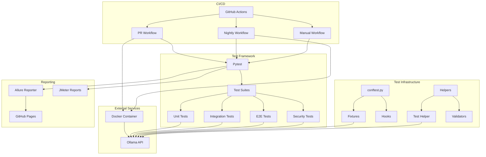
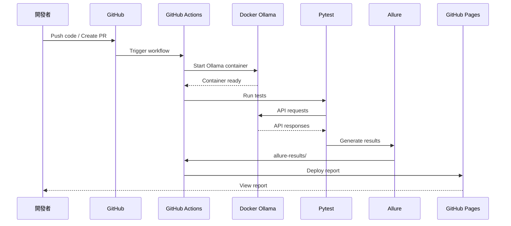

# Component Diagram

## 系統元件架構圖



---

## 元件詳細說明

### 1. **Test Framework (測試框架)**

#### Pytest
- **角色**: 核心測試執行引擎
- **版本**: 7.4+
- **責任**: 測試發現、執行、報告生成
- **配置檔**: `pytest.ini`

#### Test Suites
- **Unit Tests** (6 files, ~30 seconds)
- **Boundary Tests** (6 files, ~45 seconds)
- **Compatibility Tests** (4 files, ~2-3 minutes)
- **Error Handling Tests** (2 files, ~15 seconds)
- **Integration Tests** (5 files, ~5-8 minutes)
- **E2E Tests** (5 files, ~10-15 minutes)
- **Regression Tests** (5 files, ~3-5 minutes)
- **Security Tests** (5 files, ~2-4 minutes)

---

### 2. **Test Infrastructure (測試基礎設施)**

#### conftest.py
```python
# 共用 fixtures 定義
@pytest.fixture(scope="session")
def ollama_client():
    """提供 Ollama 客戶端"""
    return OllamaClient(base_url="http://localhost:11434")
```

#### Helpers Module
- **test_helper.py**: 測試輔助函式
- **validators.py**: 驗證器

#### Pages Module (Page Object Pattern)
- **ollama_client.py**: Ollama API 客戶端封裝

---

### 3. **External Services (外部服務)**

#### Ollama API
- **端點**: `http://localhost:11434`
- **主要 API**: `/api/chat`, `/api/tags`, `/api/version`

#### Docker Container
```yaml
services:
  ollama:
    image: ollama/ollama:latest
    ports:
      - "11434:11434"
```

---

### 4. **Reporting (報告系統)**

#### Allure Reporter
- **輸出目錄**: `allure-results/`
- **報告目錄**: `allure-report/`

#### JMeter Reports
- **輸出目錄**: `jmeter-dashboard-report/`

#### GitHub Pages
- **URL**: `https://howie0721.github.io/Local_LLM_API_TestSuite/`

---

### 5. **CI/CD (持續整合/部署)**

#### GitHub Actions Workflows

##### PR Workflow
- **Trigger**: pull_request
- **Tests**: unit + boundary + compatibility + error_handling
- **Duration**: 5-10 minutes

##### Nightly Workflow
- **Trigger**: schedule (cron: '0 0 * * *')
- **Tests**: e2e + regression + security + integration + usability
- **Duration**: 20-30 minutes

##### Manual Workflow
- **Trigger**: workflow_dispatch
- **Parameters**: marker, python-version, parallel

---

## 元件互動流程

### 測試執行流程



---

## 目錄結構圖

```
Local_LLM_test/
├── 📄 Readme.md
├── 📄 pytest.ini
├── 📄 requirements.txt
│
├── 📁 .github/workflows/
│   ├── pr-tests.yml
│   ├── nightly-tests.yml
│   └── manual-tests.yml
│
├── 📁 docs/                        # 20+ 文件
│   ├── Architecture.md
│   ├── Test_Strategy.md
│   └── ...
│
├── 📁 helpers/
│   └── test_helper.py
│
├── 📁 Pages/
│   └── ollama_client.py
│
├── 📁 tests/
│   ├── conftest.py
│   ├── fixtures/
│   ├── unit/                       # 6 files
│   ├── boundary/                   # 6 files
│   ├── compatibility/              # 4 files
│   ├── error_handling/             # 2 files
│   ├── integration/                # 5 files
│   ├── e2e/                        # 5 files
│   ├── regression/                 # 5 files
│   └── security/                   # 5 files
│
├── 📁 allure-results/
├── 📁 allure-report/
└── 📁 jmeter-dashboard-report/
```

---

## 技術堆疊總覽

| 層級 | 技術/工具 | 版本 | 用途 |
|------|----------|------|------|
| **測試框架** | Pytest | 7.4+ | 測試執行 |
| | pytest-xdist | 3.3+ | 並行測試 |
| | allure-pytest | 2.13+ | 測試報告 |
| **被測系統** | Ollama | 0.1.14+ | LLM 本地運行 |
| **容器化** | Docker | 24.0+ | 環境隔離 |
| **CI/CD** | GitHub Actions | - | 自動化流程 |
| **效能測試** | JMeter | 5.6+ | 負載測試 |

---

**維護者**: @howie0721  
**最後更新**: 2025-11-04
